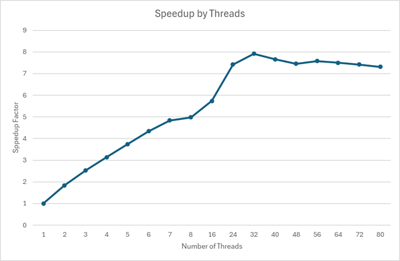

## Program Timings

For the following table, the program speed-up was computed using the ratio of the runtime for the single-threaded version of the program, divided by the runtime of the threaded version,

$$ \mathrm{speed\hbox{-}up} = \frac{T_1}{T_n} \qquad(1) $$

where $n$ is the number of threads.

|Thread Count|Wall Clock Time|User Time|System Time|Speed-up|
|:--:|:--:|:--:|:--:|:--:|
|1|14.18|13.53| 0.51|1.00|
|2| 7.72|14.27| 0.59| 1.84|
|3| 5.63|15.09| 0.71| 2.52|
|4| 4.51|15.62| 0.79| 3.14|
|5| 3.79|15.83| 0.88| 3.74|
|6| 3.27|15.92| 0.98| 4.34|
|7| 2.93|16.24| 1.04| 4.84|
|8| 2.85|16.83| 1.24| 4.98|
|16| 2.47|18.07| 2.98| 5.74|
|24| 1.91|18.58| 5.37| 7.42|
|32| 1.79|18.09|12.01| 7.92|
|40| 1.85|17.21|18.27| 7.66|
|48| 1.90|16.94|18.95| 7.46|
|56| 1.87|16.77|26.62| 7.58|
|64| 1.89|16.55|28.14| 7.50|
|72| 1.91|16.85|28.91| 7.42|
|80| 1.94|17.21|21.76| 7.31|

## Amdahl's Law

For threaded programs, we can partition the program's running time as the **serial** time, which is the time for code we can't thread; and the **parallel** time, which is the program's time for code that can be threaded and executed across multiple processors.  Mathematically, we can phrase that as $T = sT + pT$, where $s$ is the **serial** time, and $p$ is the **parallel** time.  However, that equation just states that $s + p = 1$, but that's useful as we're interested in understanding how much the program can be made to go faster.  If we define $s = 1 - p$, we can rewrite the equation as $T = (1 - p)T + pT$.  Again, not Earth shattering, but we can now incorporate threading the program.  For example, let's say we're going to use 10 threads, so the "parallel term", $pT$, is now divided across 10 threads, or $\frac{p}{10}T$.  If we substitute that in for the parallel term, and do some simplification, we get the following equation substituting $n$ in for the number of threads

$$ T = (1 - p) + \frac{p}{n} $$

If we let the left-hand side of the equation represent our single-threaded running time, and the right-hand side be our threaded speed, and using our equation for the speed-up (equation 1 above), we get

$$ \mathrm{speed\hbox{-}up} = \frac{T_1}{T_n} = \frac{1}{(1 - p) + \frac{p}{n}} $$

Using our `ScopeTimer` class, we can time each of the **seria** sections.  My experiments indicated that the serial time amounted to about .14 seconds.   
